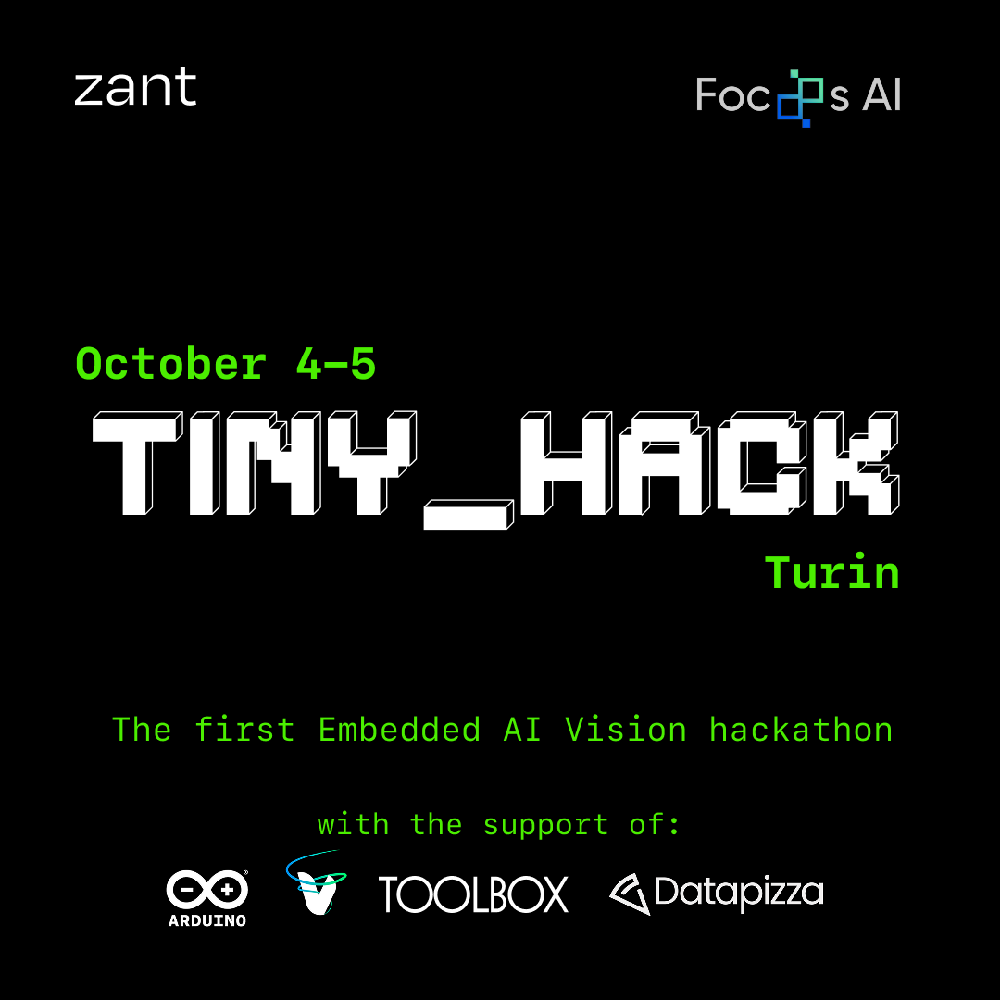

  

This repository contains a proposed solution for the challenge of the [TinyML Hackathon](https://luma.com/59rubmuv)
that took place on Oct. 4-5th in Turin.

> We’ve all been there: rubbing our backs and wondering if it’s an injury or just too many minutes of bad posture. 
> We’d rather prevent than fix. So we built a tiny on-device vision model that checks whether your posture is good
> enough and nudges you only when it really matters. If and only if you stay in bad posture for N seconds, it sends
> a gentle alert. Sit up straight, and it quietly resets.

## Overview

A high-level view of the software pipeline:
- Model finetuning using [focoos](https://github.com/FocoosAI/focoos)
- Model quantization [focoos](https://github.com/FocoosAI/focoos)
- ONNX Model processing by [Zant](https://github.com/ZantFoundation/Z-Ant)
- Model deployment on the microntroller Nicla Vision

## Description

We first chose a classification model from [focoos](https://github.com/FocoosAI/focoos) pool. After several tests we
opted for `fai-cls-s-coco` a "small" model trained to classify images within a set of 80 objects.
The whole pipeline for this stage is documented at [here](./src/extra/model_finetuning.ipynb).

The fine tuning was done using [this](https://universe.roboflow.com/dataset-sqm0h/sitting-posture-ezkda) and 
[this](https://universe.roboflow.com/min-bnvzi/sitting-posture-v2) dataset from Roboflow where individuals took photo of
themselves .

Then the model was post-trained quantized using calibration images to make it fit the Arduino Nicla Vision flash memory storage..
We sampled the calibration set from the validation split, selecting ~30–40 images with a good diversity (both classes, different subjects, lighting, viewpoints, scales).

Finally, `zig` code for the onnx exported model above was compiled as a shared library as described in [`docs`](./docs/).
The model was then deployed on the nicla vision. In the `src/extra` directory you can find assets used with the deployed 
model.

## License

Code written by us is MIT licensed. Code taken from other sources is reported and licensed accordingly.
